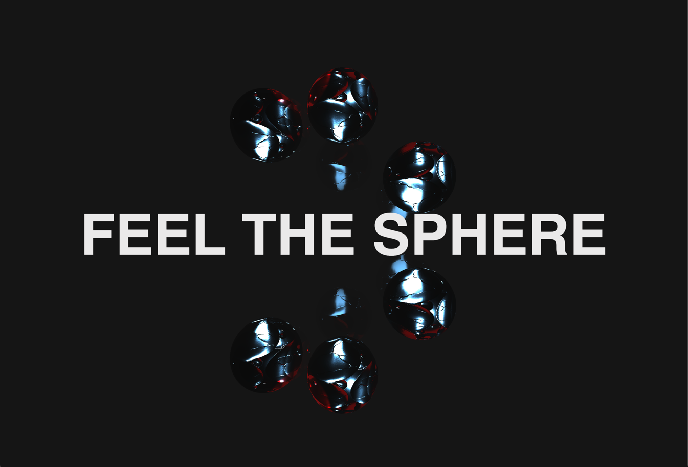

# Three.js intro project

First time working with three.js on 3d animations using a boilerplate specifically made for three.js projects.

#### [deployed version](https://threejs-intro-izidor.netlify.app/)

### Main goals

Experimenting with lighting, animating movements and working with grouped objects.


## Setup

``` bash
# Install dependencies (only the first time)
npm install

# Run the local server at localhost:8080
npm run dev

# Build for production in the dist/ directory
npm run build
```


